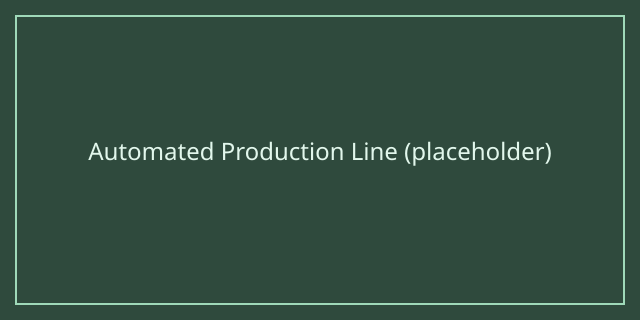

# Automation

Once your production lines are stable, automation lets you scale up without babysitting every factory by hand. Most games offer some combination of conveyor belts, robotic arms, and rule-based logistics that can be configured once and left running.

## Tips

- Start automating your **most repetitive** task first — usually raw material transport — before tackling more complex sorting or quality-control steps.
- Watch out for **automation upkeep costs**; some games charge ongoing fees or power draw for automated equipment that can eat into profits if left unchecked.
- Many games let you save automation "blueprints" or templates. Building a reusable template for a common factory layout can save huge amounts of setup time later.

## Common pitfalls

A frequent beginner mistake is automating a line before the underlying production ratios are correct — this just automates the bottleneck instead of fixing it. Always verify throughput manually first, then automate.
