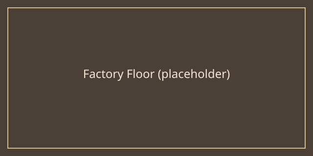

# Factories

Factories are the backbone of any tycoon empire. Each factory converts raw materials into more valuable goods, and chaining factories together is how you build efficient, profitable production lines.

## Basics

- **Input and output rates** determine how fast a factory consumes materials and produces goods. Mismatched rates upstream and downstream create bottlenecks.
- **Upgrades** usually increase throughput but also increase power or maintenance costs, so plan your budget before committing.
- **Placement matters** — factories placed closer together (or connected by good roads/belts) waste less time moving goods between them.

## Subtopics

This section covers two related topics in more depth:

- [Automation](#/factories/automation) — reducing manual intervention in your production lines.
- [Logistics](#/factories/logistics) — moving goods efficiently between factories, warehouses, and markets.

As a general rule, get your core production chain stable before investing heavily in automation or logistics upgrades.
