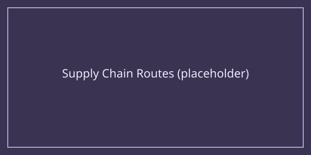

# Logistics

Logistics covers everything involved in moving goods between your factories, warehouses, and the wider market. Even a perfectly efficient factory is worthless if its output can't get where it needs to go.

## Key concepts

- **Warehouses** act as buffers between production stages, smoothing out temporary imbalances in supply and demand.
- **Transport capacity** — trucks, trains, ships, or conveyor networks — has a maximum throughput. Overloading a route causes queuing and wasted time.
- **Route planning** can often be automated once you unlock the relevant tech, letting goods flow along preset paths without manual dispatching.

## Practical advice

When your supply chain feels sluggish, check for a single overloaded transport link before assuming your factories themselves are underperforming — logistics bottlenecks are one of the most common (and easiest to fix) causes of poor overall output.
